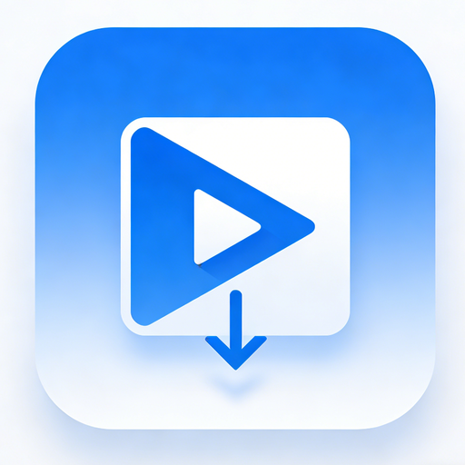

<p align="center">
  
</p>

<h1 align="center">FerrisLoad — M3U8 Downloader & Transcoder</h1>

<p align="center">
  <a href="https://github.com/blueokanna/m3u8-downloader/releases/latest"></a>
  <a href="https://github.com/blueokanna/m3u8-downloader/actions/workflows/release.yml"></a>
  <a href="LICENSE"></a>
  
  
</p>

<p align="center">
  高性能跨平台 HLS/M3U8 视频下载器，使用 <strong>Flutter</strong> 构建 UI，<strong>Rust</strong> 驱动核心下载与转码引擎。<br>
  A high-performance cross-platform HLS/M3U8 video downloader powered by <strong>Flutter</strong> UI and <strong>Rust</strong> core engine.
</p>

<p align="center">
  <a href="#功能特性">功能特性</a> •
  <a href="#平台支持">平台支持</a> •
  <a href="#快速安装">快速安装</a> •
  <a href="#从源码构建">从源码构建</a> •
  <a href="#使用指南">使用指南</a> •
  <a href="#技术架构">技术架构</a> •
  <a href="#docker-部署">Docker 部署</a> •
  <a href="#常见问题">常见问题</a> •
  <a href="#贡献指南">贡献指南</a> •
  <a href="#许可证">许可证</a>
</p>

---

## 功能特性

### 核心功能

- **M3U8/HLS 下载** — 自动解析 Master/Media 播放列表，支持多层级嵌套
- **AES-128 解密** — 自动检测并解密 HLS AES-128 加密流，支持自定义 IV
- **并发分片下载** — 基于 Tokio 异步运行时，可配置并发数（信号量控制），显著提升下载速度
- **TS → MP4 转码** — 下载完成后自动合并分片并转码为标准 MP4 格式
- **断点续传 & 重试** — 可配置重试次数，网络波动时自动恢复

### 转码引擎

| 平台 | 转码方式 | 硬件加速 |
|------|---------|---------|
| Android | MediaCodec (JNI) | ✅ 设备原生硬件编解码 |
| Windows | FFmpeg | ✅ NVENC (NVIDIA) / AMF (AMD) / CPU 回退 |
| Linux | FFmpeg | ✅ NVENC / AMF / CPU 回退 |
| macOS | FFmpeg | CPU (libx264) |

### Android 专属特性

- **前台服务** — 下载/转码期间保持后台运行，不被系统杀死
- **WakeLock** — 防止 CPU 休眠，确保长时间任务完成
- **MediaStore API** — 兼容 Android 10+ Scoped Storage，文件保存到公共 Downloads 目录
- **电池优化豁免** — 可请求忽略电池优化，避免后台任务被限制
- **通知栏进度** — 实时显示下载/转码进度

### 界面特性

- Material Design 3 风格 UI
- 亮色/暗色主题切换
- 动态主题色（Seed Color）
- 实时进度日志输出
- 自定义输出目录选择

---

## 平台支持

| 平台 | 架构 | 状态 | 下载 |
|------|------|------|------|
| Android | arm64-v8a, armeabi-v7a, x86_64, x86 | ✅ 完整支持 | [APK](https://github.com/blueokanna/m3u8-downloader/releases/latest) |
| Windows | x86_64 | ✅ 完整支持 | [ZIP](https://github.com/blueokanna/m3u8-downloader/releases/latest) |
| Linux | x86_64 | ✅ 完整支持 | [tar.gz](https://github.com/blueokanna/m3u8-downloader/releases/latest) |
| macOS | x86_64 / arm64 | 🔧 实验性 | 需自行编译 |
| iOS | arm64 | 🔧 实验性 | 需自行编译 |

---

## 快速安装

### 方式一：下载预编译包（推荐）

前往 [Releases 页面](https://github.com/blueokanna/m3u8-downloader/releases/latest) 下载对应平台的安装包：

| 平台 | 文件 | 说明 |
|------|------|------|
| Android | `FerrisLoad-android.apk` | 直接安装，需允许"未知来源" |
| Windows | `FerrisLoad-windows-x64.zip` | 解压后运行 `m3u8_downloader.exe` |
| Linux | `FerrisLoad-linux-x64.tar.gz` | 解压后运行 `m3u8_downloader`，需安装 FFmpeg |

### 方式二：从源码构建

见下方 [从源码构建](#从源码构建) 章节。

---

### Windows 运行前提

Windows 版本开箱即用，无需额外依赖。如需转码功能，建议安装 FFmpeg：

```powershell
# 使用 winget 安装
winget install Gyan.FFmpeg

# 或使用 scoop
scoop install ffmpeg
```

### Linux 运行前提

```bash
# Ubuntu / Debian
sudo apt-get install -y ffmpeg libgtk-3-0 liblzma5

# Fedora
sudo dnf install ffmpeg gtk3 xz-libs

# Arch Linux
sudo pacman -S ffmpeg gtk3 xz
```

### Android 运行前提

- Android 5.0 (API 21) 及以上
- 无需额外依赖，转码使用设备内置 MediaCodec

---

## 从源码构建

### 环境要求

| 工具 | 版本要求 | 用途 |
|------|---------|------|
| [Flutter](https://docs.flutter.dev/get-started/install) | >= 3.27.x (stable) | UI 框架 |
| [Rust](https://rustup.rs/) | stable (最新) | 核心引擎 |
| [flutter_rust_bridge_codegen](https://cjycode.com/flutter_rust_bridge/) | 2.11.1 | Dart / Rust FFI 代码生成 |
| [Java JDK](https://adoptium.net/) | 17 | Android 编译 |
| [Android SDK & NDK](https://developer.android.com/studio) | NDK r27 | Android 原生编译 |
| [cargo-ndk](https://github.com/nichuanfang/cargo-ndk) | 最新 | Android Rust 交叉编译 |

### 1. 克隆仓库

```bash
git clone https://github.com/blueokanna/m3u8-downloader.git
cd m3u8-downloader
```

### 2. 安装 Rust 工具链

```bash
# 安装 Rust（如果尚未安装）
curl --proto '=https' --tlsv1.2 -sSf https://sh.rustup.rs | sh

# 安装代码生成工具
cargo install flutter_rust_bridge_codegen --version 2.11.1

# Android 交叉编译工具（仅构建 Android 时需要）
cargo install cargo-ndk

# 添加 Android 编译目标
rustup target add aarch64-linux-android armv7-linux-androideabi x86_64-linux-android i686-linux-android
```

### 3. 获取依赖 & 生成桥接代码

```bash
flutter pub get
flutter_rust_bridge_codegen generate
```

### 4. 构建

#### Android APK

```bash
# 先编译 Rust 原生库（需要设置 ANDROID_NDK_HOME）
cd rust
cargo ndk -t arm64-v8a -t armeabi-v7a -t x86_64 -t x86 \
  -o ../android/app/src/main/jniLibs build --release
cd ..

# 生成启动图标
dart run flutter_launcher_icons

# 构建 APK
flutter build apk --release

# 产物位于: build/app/outputs/flutter-apk/app-release.apk
```

#### Windows

```powershell
flutter build windows --release

# 产物位于: build\windows\x64\runner\Release\
```

#### Linux

```bash
# 安装构建依赖
sudo apt-get install -y clang cmake ninja-build pkg-config libgtk-3-dev liblzma-dev

flutter build linux --release

# 产物位于: build/linux/x64/release/bundle/
```

#### macOS（实验性）

```bash
flutter build macos --release
```

---

## 使用指南

### 基本使用流程

1. **启动应用** — 打开 FerrisLoad
2. **输入 M3U8 URL** — 在 URL 输入框中粘贴 M3U8 播放列表地址
3. **设置输出文件名** — 输入期望的输出文件名（不含扩展名）
4. **选择保存目录**（可选）— 点击文件夹图标选择输出目录
5. **调整参数**（可选）：
   - **并发数** — 同时下载的分片数量（默认 10，建议 5-20）
   - **重试次数** — 单个分片下载失败后的重试次数（默认 3）
   - **视频码率** — 转码输出视频码率（0 = 保持原始）
   - **音频码率** — 转码输出音频码率（0 = 保持原始）
6. **开始下载** — 点击下载按钮，观察实时进度日志

### 参数说明

| 参数 | 默认值 | 说明 |
|------|--------|------|
| URL | — | M3U8 播放列表地址（必填） |
| 文件名 | output | 输出 MP4 文件名 |
| 并发数 | 10 | 并行下载分片数，过高可能触发服务器限流 |
| 重试次数 | 3 | 单分片最大重试次数 |
| 视频码率 | 0 | 输出视频码率 (kbps)，0 表示保持原始 |
| 音频码率 | 0 | 输出音频码率 (kbps)，0 表示保持原始 |

### Android 特别说明

- 首次使用需授予**存储权限**和**通知权限**
- 建议在设置中关闭**电池优化**（应用会提示引导）
- 下载的文件保存在 `Downloads/FerrisLoad/` 目录下
- 下载过程中会显示前台服务通知，确保后台不被杀死

### 桌面端特别说明

- Windows/Linux 版本需要系统安装 **FFmpeg** 才能进行转码
- 如果不安装 FFmpeg，下载的 TS 文件将不会自动转码为 MP4
- 应用会自动检测 GPU 硬件加速能力（NVIDIA NVENC / AMD AMF）

---

## 技术架构

### 整体架构

```
┌─────────────────────────────────────────────────────────┐
│                    Flutter UI (Dart)                      │
│  ┌──────────┐  ┌──────────┐  ┌────────────────────────┐ │
│  │ URL 输入  │  │ 进度显示  │  │ 文件选择 / 权限管理    │ │
│  └──────────┘  └──────────┘  └────────────────────────┘ │
├─────────────────────────────────────────────────────────┤
│              flutter_rust_bridge (FFI)                    │
│         StreamSink<ProgressUpdate> 实时进度流             │
├─────────────────────────────────────────────────────────┤
│                  Rust Core Engine                         │
│  ┌──────────┐  ┌──────────┐  ┌────────────────────────┐ │
│  │ M3U8 解析 │  │ 并发下载  │  │ AES-128 解密           │ │
│  │ (m3u8-rs) │  │ (tokio)  │  │ (aes + block-modes)    │ │
│  └──────────┘  └──────────┘  └────────────────────────┘ │
│  ┌──────────────────────────────────────────────────────┐│
│  │              转码引擎选择                              ││
│  │  Android: JNI → MediaCodec (硬件加速)                 ││
│  │  Desktop: FFmpeg (NVENC / AMF / libx264)              ││
│  └──────────────────────────────────────────────────────┘│
├─────────────────────────────────────────────────────────┤
│              Android Native (Kotlin)                     │
│  ┌──────────────┐  ┌──────────────┐  ┌────────────────┐ │
│  │ MainActivity  │  │ MediaStore   │  │ ForegroundSvc  │ │
│  │ (JNI+Channel) │  │ Helper       │  │ (WakeLock)     │ │
│  └──────────────┘  └──────────────┘  └────────────────┘ │
└─────────────────────────────────────────────────────────┘
```

### 下载流程

```
M3U8 URL
   │
   ▼
┌──────────────────┐
│ 解析播放列表      │ ← Master Playlist? → 选择最高带宽变体
│ (m3u8-rs)        │
└────────┬─────────┘
         │
         ▼
┌──────────────────┐
│ 检测加密方式      │ ← AES-128? → 获取 Key + IV
└────────┬─────────┘
         │
         ▼
┌──────────────────┐
│ 并发下载分片      │ ← Semaphore 控制并发数
│ (tokio + reqwest)│ ← 自动重试失败分片
│                  │ ← 实时进度回调 → Flutter UI
└────────┬─────────┘
         │
         ▼
┌──────────────────┐
│ 合并 TS 分片      │ → 按序拼接为单个 .ts 文件
└────────┬─────────┘
         │
         ▼
┌──────────────────┐
│ 转码为 MP4        │ ← Android: MediaCodec (JNI)
│                  │ ← Desktop: FFmpeg (硬件加速检测)
└────────┬─────────┘
         │
         ▼
┌──────────────────┐
│ 保存到目标目录    │ ← Android: MediaStore API
│                  │ ← Desktop: 直接文件写入
└──────────────────┘
```

### 技术栈详情

#### Rust 依赖

| 库 | 版本 | 用途 |
|----|------|------|
| `flutter_rust_bridge` | 2.11.1 | Dart / Rust FFI 桥接 |
| `tokio` | 1.x | 异步运行时（多线程） |
| `reqwest` | 0.12.x | HTTP 客户端（rustls TLS） |
| `m3u8-rs` | 6.0 | M3U8 播放列表解析 |
| `aes` + `block-modes` | 0.7 / 0.8 | AES-128-CBC 解密 |
| `jni` | 0.21 | Android JNI 调用 |
| `warp` | 0.3 | API 服务器（可选） |
| `serde` + `serde_json` | 1.0 | JSON 序列化 |

#### Flutter 依赖

| 库 | 用途 |
|----|------|
| `flutter_rust_bridge` | Rust FFI 桥接 |
| `file_picker` | 跨平台文件/目录选择 |
| `permission_handler` | Android 权限管理 |
| `cupertino_icons` | iOS 风格图标 |

---

## CI/CD

项目使用 GitHub Actions 自动构建和发布。

### 触发方式

| 触发条件 | 说明 |
|---------|------|
| 推送 `v*` 标签 | 自动构建所有平台并创建 Release |
| 手动触发 (workflow_dispatch) | 可指定标签名，或仅构建不发布 |

### 构建矩阵

| Job | 运行环境 | 产物 |
|-----|---------|------|
| `build-android` | ubuntu-latest | `FerrisLoad-android.apk` |
| `build-windows` | windows-latest | `FerrisLoad-windows-x64.zip` |
| `build-linux` | ubuntu-latest | `FerrisLoad-linux-x64.tar.gz` |

### 发布新版本

```bash
# 1. 更新 pubspec.yaml 中的版本号
# version: 1.1.0+2

# 2. 提交更改
git add -A
git commit -m "release: v1.1.0"

# 3. 创建标签并推送
git tag v1.1.0
git push origin main --tags
```

GitHub Actions 会自动：
1. 编译 Android APK（4 种 CPU 架构）
2. 编译 Windows x64 可执行文件
3. 编译 Linux x64 可执行文件
4. 创建 GitHub Release 并上传所有产物
5. 自动生成 Release Notes（基于 commit 历史）

---

## Docker 部署

项目提供 Docker 支持，可用于 Linux 桌面环境或 API 服务模式。

### 快速启动（GUI 模式）

```bash
# 构建镜像
docker build -t ferrisload .

# 运行（需要 X11 显示支持）
docker run -it --rm \
  -e DISPLAY=$DISPLAY \
  -v /tmp/.X11-unix:/tmp/.X11-unix:rw \
  -v $(pwd)/downloads:/app/downloads:rw \
  ferrisload
```

### Docker Compose

```bash
# GUI 模式
docker-compose up m3u8-downloader

# API 模式（可选）
docker-compose --profile api up m3u8-api
```

### 环境变量

| 变量 | 默认值 | 说明 |
|------|--------|------|
| `DISPLAY` | — | X11 显示服务器（GUI 模式必需） |
| `FFMPEG_PATH` | `/usr/bin/ffmpeg` | FFmpeg 可执行文件路径 |
| `DOWNLOAD_DIR` | `/app/downloads` | 下载文件保存目录 |
| `API_PORT` | `3000` | API 服务监听端口 |

---

## 项目结构

```
m3u8-downloader/
├── .github/
│   └── workflows/
│       └── release.yml          # CI/CD 构建 & 发布
├── android/                     # Android 平台代码
│   └── app/src/main/kotlin/com/bluevale/m3u8_downloader/
│       ├── MainActivity.kt      # Flutter 引擎配置 + MethodChannel
│       ├── MediaTranscoder.kt   # MediaCodec 硬件转码（JNI 调用）
│       ├── MediaStoreHelper.kt  # Scoped Storage 文件保存
│       └── DownloadForegroundService.kt  # 前台服务 + WakeLock
├── lib/
│   ├── main.dart                # Flutter 应用入口 + UI
│   └── src/rust/                # flutter_rust_bridge 生成的 Dart 绑定
├── rust/
│   ├── Cargo.toml               # Rust 依赖配置
│   └── src/
│       ├── lib.rs               # 库入口
│       ├── frb_generated.rs     # 桥接生成代码
│       ├── api/
│       │   ├── mod.rs
│       │   └── downloader.rs    # 核心下载 & 转码逻辑
│       └── bin/
│           └── m3u8_api_server.rs  # 可选 API 服务器
├── rust_builder/                # flutter_rust_bridge 构建集成 (cargokit)
├── assets/                      # 应用图标资源
├── Dockerfile                   # Linux Docker 构建
├── docker-compose.yml           # Docker Compose 编排
├── flutter_rust_bridge.yaml     # 桥接代码生成配置
└── pubspec.yaml                 # Flutter 项目配置
```

---

## 常见问题

### Q: Android 编译报 R8 Missing classes 错误？

这是因为 Flutter 引擎引用了 Google Play Core 的 deferred components 类，但项目不使用该功能。在 `android/app/proguard-rules.pro` 中添加：

```
-dontwarn com.google.android.play.core.splitcompat.SplitCompatApplication
-dontwarn com.google.android.play.core.splitinstall.**
-dontwarn com.google.android.play.core.tasks.**
```

### Q: Kotlin 编译报 "Storage is already registered" 错误？

这是 Kotlin 增量编译缓存损坏导致的。清理 build 缓存即可：

```bash
# 清理项目 build 目录
rm -rf build/

# 清理 Gradle 缓存
rm -rf android/.gradle/

# 重新构建
flutter build apk --release
```

### Q: Windows/Linux 下载完成但没有转码？

确保系统已安装 FFmpeg 并且在 PATH 中可用：

```bash
ffmpeg -version
```

如果未安装，参考 [Linux 运行前提](#linux-运行前提) 或 [Windows 运行前提](#windows-运行前提)。

### Q: Android 下载过程中应用被杀死？

1. 确保已授予通知权限（前台服务需要）
2. 在系统设置中关闭该应用的电池优化
3. 应用启动时会提示请求忽略电池优化，建议允许

### Q: 如何修改默认并发数？

在应用界面中直接修改"并发数"输入框的值。建议范围 5-20，过高可能导致服务器限流或连接超时。

### Q: 支持哪些 M3U8 格式？

- ✅ Master Playlist（自动选择最高带宽变体）
- ✅ Media Playlist（直接下载）
- ✅ AES-128 加密流
- ✅ 自定义 IV
- ✅ 标准 MPEG-TS 分片

### Q: CI 构建失败怎么排查？

1. 检查 GitHub Actions 日志中的具体错误
2. 确认 `pubspec.yaml` 中的版本号格式正确
3. 确认 `flutter_rust_bridge_codegen` 版本与 `pubspec.yaml` 中的 `flutter_rust_bridge` 版本匹配（当前均为 2.11.1）
4. Rust 编译错误通常与 NDK 版本有关，确保使用 NDK r27

---

## 贡献指南

欢迎贡献代码、报告 Bug 或提出功能建议。

### 开发流程

1. Fork 本仓库
2. 创建功能分支：`git checkout -b feature/my-feature`
3. 提交更改：`git commit -m "feat: add my feature"`
4. 推送分支：`git push origin feature/my-feature`
5. 创建 Pull Request

### Commit 规范

项目使用 [Conventional Commits](https://www.conventionalcommits.org/) 规范：

| 前缀 | 说明 |
|------|------|
| `feat:` | 新功能 |
| `fix:` | Bug 修复 |
| `docs:` | 文档更新 |
| `refactor:` | 代码重构 |
| `ci:` | CI/CD 配置更改 |
| `chore:` | 其他杂项 |

### 开发环境设置

```bash
# 克隆并进入项目
git clone https://github.com/blueokanna/m3u8-downloader.git
cd m3u8-downloader

# 安装依赖
flutter pub get

# 生成桥接代码（修改 Rust API 后需要重新运行）
flutter_rust_bridge_codegen generate

# 运行调试版本
flutter run
```

---

<p align="center">
  Made with 🦀 Rust + 💙 Flutter by blueokanna
</p>
